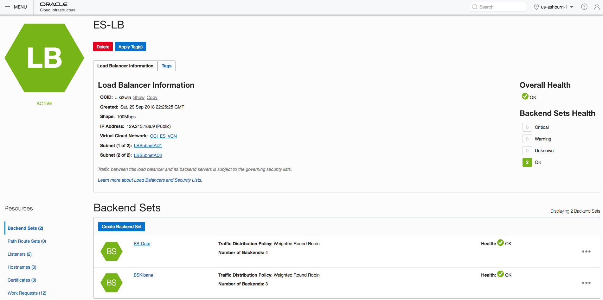
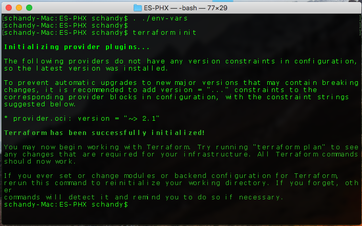
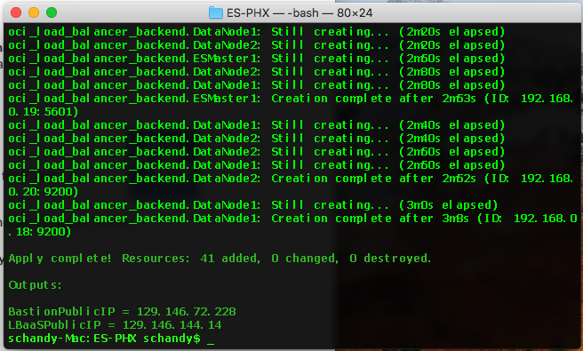
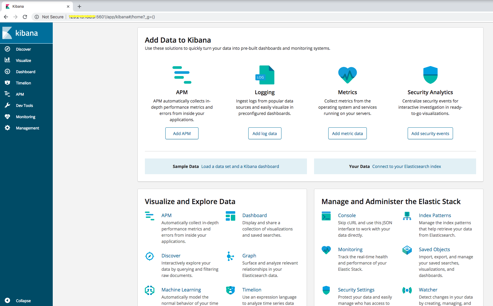
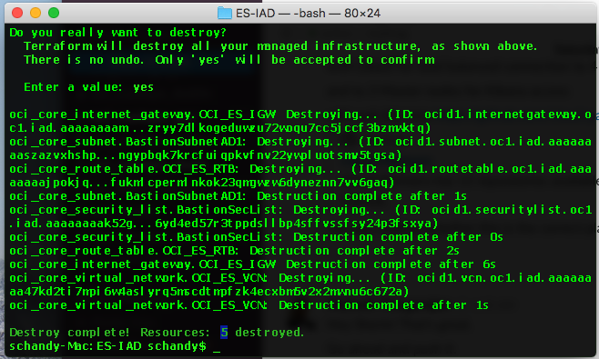

# OCI Elasticsearch Quick Start

Quick Start a Highly Available Elasticsearch Cluster on OCI. 

# Prerequisites
First off you'll need to do some pre deploy setup.  That's all detailed [here](https://github.com/cloud-partners/oci-prerequisites).

# Architecture Brief


This deploys an Elasticsearch cluster with 3 master nodes in all 3 ADs and 4 data nodes in 2 ADs. Necessary Elasticsearch [configuration](https://www.elastic.co/guide/en/elasticsearch/reference/current/allocation-awareness.html) is in place to make sure primary and replica of the same same index sharda are never stored in the same AD. Currently 200GB additional volume is added to data nodes for index, this can be modified by editing variabes.tf.

### Cluster Compute Instances on OCI Console


OCI LBaaS is used for load balancing index operations onto the data nodes and Kibana access to master nodes, by using 2 different listeners one for Kibana and other for index data access, backed by backend set with master node backends and data node backends respectively. LBaaS is launched into public subnet with public IP, this can be modified by modifying the lbaas.tf to make it private LBaaS.

### Load Balancer on OCI Console



## How to Launch the Cluster.
1. Download or clone the files to your local machine with Terraform installed 
2. Edit env-vars file and fill your OCI credentials
3. Exceute below script to set OCI crendials in your environment 

       . ./env-vars

4. Edit variables.tf and change any parameter values like VM/BM, LBaaS shape and data volume size
5. Run below terraform commands to deploy the cluster.
   
       terraform init
       
### Sample Output of terraform init:



       terraform plan

### Sample Output of terraform plan:


       terraform apply

### Sample Output of terraform apply:



Once the launch is finished use bastion public IP to access the Elasticsearch cluster nodes and use LBaaS IP address to accees 
Elasticsearch and Kibana as shown below.

       http://<LBaaS_IP>:9200/_cat     <==== Elasticsearch URL from browser or use curl intead.

### Sample output of "curl -XGET LBaaS_IP:9200" :
       
   ```
       {
         "name" : "esdatanode1",
         "cluster_name" : "oci-es-cluster",
         "cluster_uuid" : "HQoVo6LFQqmQcaViNyyQ7w",
         "version" : {
           "number" : "6.4.0",
           "build_flavor" : "default",
           "build_type" : "rpm",
           "build_hash" : "595516e",
           "build_date" : "2018-08-17T23:18:47.308994Z",
           "build_snapshot" : false,
           "lucene_version" : "7.4.0",
           "minimum_wire_compatibility_version" : "5.6.0",
           "minimum_index_compatibility_version" : "5.0.0"
         },
         "tagline" : "You Know, for Search"
       }
   ```

       http://<LBaaS IP>:5601     <==== Kibana URL from browser 
      
### Sample Kibana Web Page:



## How to Delete the Cluster. 

From the terraform directory where the files were downloaded to, run below command to delete the entire Cluster.

       terraform destroy
       
### Sample Output of terraform destroy:


