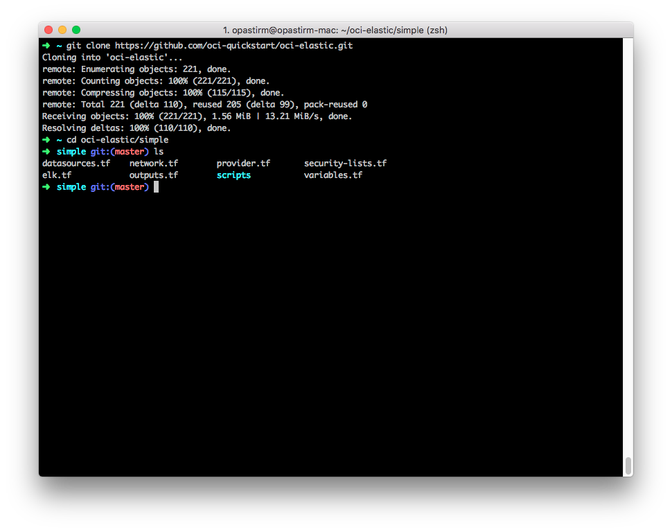
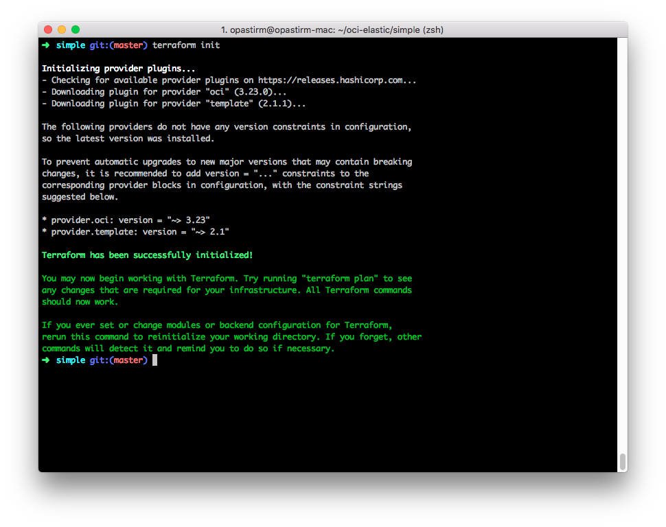
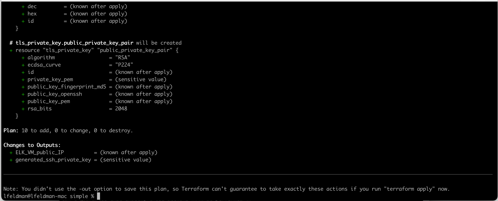
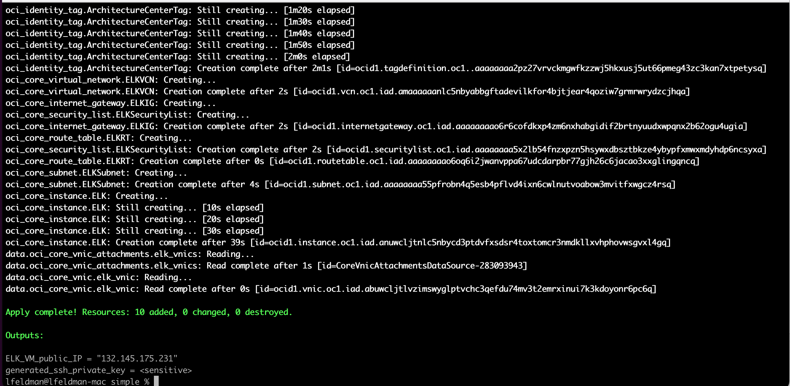
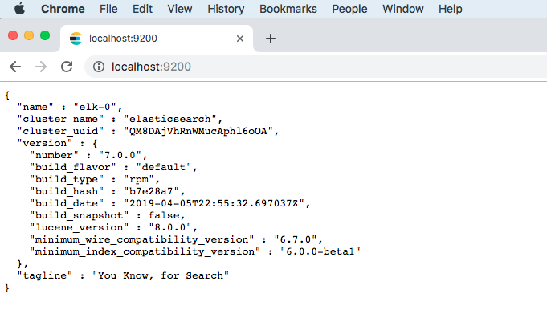
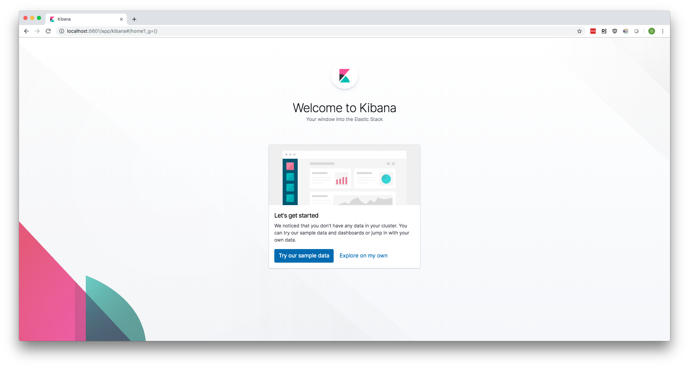

# oci-elastic (simple)

Terraform module that deploys Elasticsearch, Kibana, and Logstash on a one VM.

## Prerequisites

- Permission to `manage` the following types of resources in your Oracle Cloud Infrastructure tenancy: `vcns`, `internet-gateways`, `route-tables`, `security-lists`, `subnets`, and `instances`.

- Quota to create the following resources: 1 VCN, 1 subnet, 1 Internet Gateway, 1 route rule, and 1 compute instance.

If you don't have the required permissions and quota, contact your tenancy administrator. See [Policy Reference](https://docs.cloud.oracle.com/en-us/iaas/Content/Identity/Reference/policyreference.htm), [Service Limits](https://docs.cloud.oracle.com/en-us/iaas/Content/General/Concepts/servicelimits.htm), [Compartment Quotas](https://docs.cloud.oracle.com/iaas/Content/General/Concepts/resourcequotas.htm).

## Deploy Using Oracle Resource Manager

1. Click 

    If you aren't already signed in, when prompted, enter the tenancy and user credentials.

2. Review and accept the terms and conditions.

3. Select the region where you want to deploy the stack.

4. Follow the on-screen prompts and instructions to create the stack.

5. After creating the stack, click **Terraform Actions**, and select **Plan**.

6. Wait for the job to be completed, and review the plan.

    To make any changes, return to the Stack Details page, click **Edit Stack**, and make the required changes. Then, run the **Plan** action again.

7. If no further changes are necessary, return to the Stack Details page, click **Terraform Actions**, and select **Apply**. 

## Deploy Using the Terraform CLI

### Clone the Module
Now, you'll want a local copy of this repo.  You can make that with the commands:

    git clone https://github.com/oracle/oci-quickstart-elastic.git
    cd oci-elastic/simple
    ls

That should give you this:

### Initialize the deployment
Pick a module and change into the directory containing it (enterprise or community).

We now need to initialize the directory with the module in it.  This makes the module aware of the OCI provider.  You can do this by running:

    terraform init

This gives the following output:

### Deploy the module
Now for the main attraction.  Let's make sure the plan looks good:

    terraform plan

That gives:

If that's good, we can go ahead and apply the deploy:

    terraform apply

You'll need to enter `yes` when prompted.  Once complete, you'll see something like this:

When the apply is complete, the infrastructure will be deployed, but cloud-init scripts will still be running.  Those will wrap up asynchronously.  So, it'll be a few more minutes before your cluster is accessible.  Now is a good time to get a coffee.

### Connect to Elasticsearch and Kibana
When the module is deployed, you will see an output that shows the ELK VM public IP and generated ssh private key. Save the private key in id_rsa file and grant minimum privileges:

`chmod 400 id_rsa`

Now let's build SSH tunnels for each product of ELK:

`ELK_VM_public_IP = 132.145.139.235`

Create an SSH tunnel for ports `9200` and `5601` with the following command:

`ssh -i id_rsa -L 9200:localhost:9200 -L 5601:localhost:5601 opc@<ELK_VM_public_IP>`

Now you can browse to (http://localhost:9200) for Elasticsearch, and (http://localhost:5601) for Kibana.

### SSH to a Node
These machines are using Oracle Enterprise Linux (OEL).  The default login is opc. You can SSH into the machine with a command like this:

    ssh -i id_rsa opc@<ELK_VM_public_IP>

## View the Cluster in the Console
You can also login to the web console [here](https://console.us-phoenix-1.oraclecloud.com/a/compute/instances) to view the IaaS that is running the cluster.

### Destroy the Deployment
When you no longer need the deployment, you can run this command to destroy it:

    terraform destroy

You'll need to enter `yes` when prompted.

